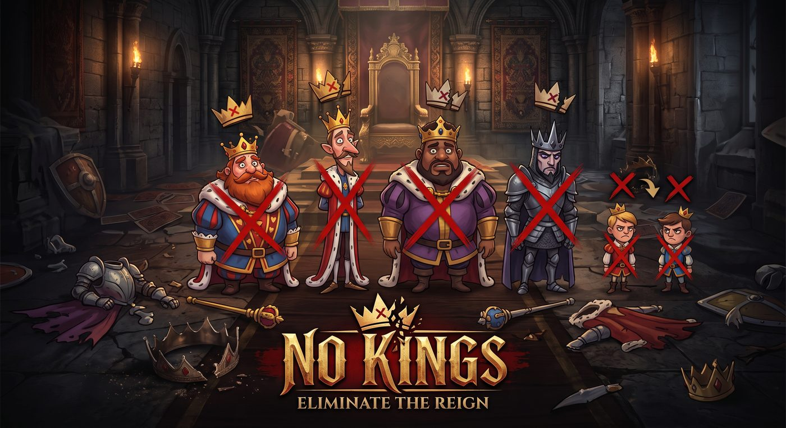

<div align="center">



# No Kings

**A card game about toppling monarchy.** Play the whole deck against the Crown — first to 50 points founds the new order.

[](https://potassiumsolutions.github.io/nokings)
[](https://www.thegamecrafter.com/games/no-kings-2-to-6)


</div>

*The realm of Cardlandia is fracturing. The Crown hoards wealth while the streets boil with unrest — yet absolute power is an intoxicating poison. Topple the old regime, claim the glory, and gather 50 points to found a new order. But beware: if tyranny secures a stronghold before the revolution succeeds, the old world wins.*

---

## What it is

No Kings is played with a **standard 52-card deck** (plus 2 Jokers), with the court renamed for the revolution. It's a physical card game with a companion **web app / PWA** — install it to your phone's home screen and play offline. The app is a single-page build: rules, an illustrated cartoon deck, a soundboard, and a "Topple the Crown" video.

- **Players:** 2–6
- **Goal:** First to **50 points** (or a Short Game to 20)
- **Languages:** English · Español · Français (in-app Language toggle)

## Get the physical game 🃏

No Kings is a **real, published game** — you can order professionally printed copies from The Game Crafter:

- 🎴 **[No Kings — Standard Edition](https://www.thegamecrafter.com/games/no-kings-2-to-4)** — 4 suits · 2–4 players
- 👑 **[No Kings — Full Edition](https://www.thegamecrafter.com/games/no-kings-2-to-6)** — 6 suits · 2–6 players
- 📖 **[No Kings — Rulebook](https://www.thegamecrafter.com/games/no-kings-instructions)** — the printed fold-out rules

Or [play free in your browser](https://potassiumsolutions.github.io/nokings).

## The Cast & the Deck

| Card | Who they are |
|------|--------------|
| **Kings (K)** | Absolute Monarchs — draw one and you must crown yourself face-up |
| **Queens (Q)** | Cunning Plotters, scheming from your hand |
| **Generals (10)** | The Military Brass — loyal to command, coup, or chaos |
| **Bishops (A)** | The Holy Order, wielding sanction against the Crown |
| **The Crowd (2–9)** | The Common Folk — weak alone, devastating united |
| **Jacks (J)** | Ambitious Heirs — never discarded; they wait for a vacant throne |
| **Jokers (×2)** | Wild agents of chaos, deadly beside a General |

Default four players are **Hearts, Diamonds, Clubs, Spades**. For 5–6, the working guilds join — **Anvils** (green) and **Wheat** (blue).

## How you topple a King

- **Palace Coup** — any 2 high cards (Q / J / General) fell 1 King. A same-suit Queen + General wipes them all.
- **Holy Decree** — 1 matching Bishop, or any 2 Bishops, topple 1 King.
- **The Mob** — three-of-a-kind or a same-suit run of 4+ topples 1 / 2 / 3 Kings.
- **Second Wave** — when every King is down, the Jacks rise as Promoted Kings; a single General fells one.

**Scoring:** Fallen King +2 · Promoted King / surviving Queen +1 · four Kings standing (or a Generals' coup) +10 · caught holding a King → your round scores 0.

> Full rules are in the app, and as print-ready PDFs in this repo (`No-Kings-Rules.pdf`, `No-Kings-Booklet.pdf`).

## Running it locally

It's a static site — no build step. Serve the folder with any static server:

```bash
python -m http.server 8000
```

Then open `http://localhost:8000`. Deployment is via GitHub Pages from this repo.

## Print & Play

The repo includes rulebook PDFs and booklets. A full print-ready card set (The Game Crafter format) was produced separately.

---

Created by **Paul A.T. Ramey** · [ksoldesigns.com](https://www.ksoldesigns.com) · © 2026 Potassium Solutions
